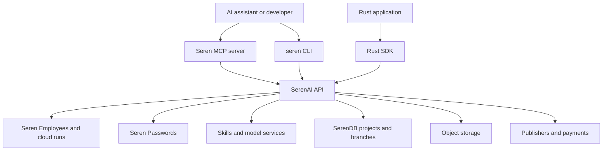

# Seren

Seren is an agent-ready backend control plane for managed agents, secure vault access, skills, model services, and supporting backend resources. It gives developers and AI coding agents one way to run Seren Employees on Seren Cloud, provision encrypted password vault access, install reusable skills, route model usage, manage branchable Postgres and object storage, and use payment flows when production work needs them. Every capability is reachable from the terminal, an SDK, or an MCP-compatible assistant.

## What Seren Provides

Seren is useful when an application or agent needs durable backend capabilities it can operate directly. The tooling exposes the operational surface around the platform so agents can inspect state, make changes, run services, access approved credentials, and recover from problems with the same primitives a backend engineer would use.

| Capability | What you can do |
|------------|-----------------|
| Seren Employees and managed agents | Run Seren Employees as managed `seren-agent` deployments on Seren Cloud, with prompt-defined behavior, tool presets, model policy, approval policy, revision history, rollback, and optional remote A2A delegation |
| Seren Cloud operations | Deploy agent bundles, inspect deployments and runs, stream activity, resolve approval gates, schedule runs, and review artifacts/eval sets |
| Seren Passwords | Store logins, API keys, secure notes, and attachments in encrypted vaults; grant scoped agent access; require approvals for sensitive reads; audit and rotate vault access |
| Skills and model services | Install and run skills, apply private-model policy and model routing, and use the publisher-backed workflows, notes, memory, and browser-automation services Desktop agents build on |
| Developer automation | Use machine-readable JSON output, reusable context, generated Rust SDK types, and MCP tools for agent-driven workflows |
| Branchable Postgres | Create SerenDB projects, branches, databases, roles, endpoints, connection strings, IP allow lists, VPC assignments, branch protection, logical replication, and audit logs |
| Branching workflows | Create development branches, restore from a point in time, compare schema changes, set expirations, and reset or promote branch state |
| Object storage | Browse Seren Storage buckets, upload and download objects, attach metadata, and manage supporting files for Seren agents, employees, and applications |
| Publishers and payments | Discover publishers, call paid database/API/MCP integrations, estimate cost, manage prepaid balance, and use x402 local signing when configured |

## How Agents Connect

Seren exposes the same platform through three interfaces:

| Interface | Best for | Entry point |
|-----------|----------|-------------|
| Hosted MCP | Claude, Codex, and other MCP clients that should operate Seren directly without local setup | `https://mcp.serendb.com/mcp` |
| CLI | Developers, scripts, CI jobs, and coding agents that can run terminal commands | `seren ...` |
| SDK | Applications that need typed API access in their own code | `seren` crate |

These same tools power the broader Seren product. Seren Desktop is the open-source AI workspace for knowledge workers and engineers - chat, skills, reusable employees, files, notes, memory, local terminals, and connected accounts - and the CLI and MCP server in this repo are the service layer those agents run on: managed agents, vaults, skills, model access, databases, storage, payments, approvals, and operator controls.



## Skill Ecosystem

Seren skills are installable capability packs for coding agents. The `seren` CLI pulls from a public registry ([serenorg/seren-skills](https://github.com/serenorg/seren-skills)) and installs a skill into the skills directory of whatever agent you use - Claude Code, Codex, Cursor, Gemini, GitHub Copilot, Windsurf, and more - so one skill works across agents instead of being tied to a single assistant. Many skills are built around Seren publishers, so an installed skill teaches an agent to call that integration, run SQL, or drive a managed agent through the Seren backend.

```bash
seren skills search issues              # discover skills in the registry
seren skills add linear-issue-tracking  # install into your agent's skills directory
seren skills installed                  # list installed skills
seren skills init my-skill              # scaffold your own
```

## Quick Start

### Connect an AI Assistant

If your MCP client supports streamable HTTP, connect it to the hosted Seren MCP endpoint:

```bash
claude mcp add --scope user --transport http seren https://mcp.serendb.com/mcp
```

Manual MCP configuration:

```json
{
  "mcpServers": {
    "seren": {
      "url": "https://mcp.serendb.com/mcp",
      "transport": "streamable-http"
    }
  }
}
```

After authorization, ask your assistant to deploy managed agents, review cloud runs, retrieve approved vault credentials, fetch skill guidance, inspect projects, run SQL, create branches, manage storage, or use publisher payment flows. See [mcp/README.md](./mcp/README.md) for local server setup, OAuth hosting, Seren Passwords delegation, x402 signing, and tool examples.

### Install and Use the CLI

```bash
cargo install --git https://github.com/serenorg/seren.git --package seren-cli

seren auth login
seren -o json agent cloud overview
seren skills search issues
seren projects list
seren projects create --name my-project --region aws-us-east-1
seren branches --project-id <project-id> create --name dev
```

See [cli/README.md](./cli/README.md) for the command reference and common workflows.

### Use the Rust SDK

```toml
[dependencies]
seren = { package = "seren-sdk", git = "https://github.com/serenorg/seren.git", tag = "v0.8.0" }
```

```rust
use seren::{Client, ClientConfig};

#[tokio::main]
async fn main() -> Result<(), Box<dyn std::error::Error>> {
    let config = ClientConfig::new("your_seren_api_key");
    let client = Client::from_config(&config)?;

    let projects = client.seren_db_list_projects().await?;
    println!("Found {} projects", projects.into_inner().data.len());

    Ok(())
}
```

The `seren` crate is generated from the [Seren OpenAPI spec](./openapi/), and typed clients for other languages can be generated from the same source.

## Packages

| Package | Description | How to use |
|---------|-------------|------------|
| [sdk](./sdk/) | Rust SDK generated from the Seren OpenAPI spec | Add from crates.io or as a Git or path dependency |
| [cli](./cli/) | Command-line interface, binary `seren` | Install from source, Git, or GitHub Releases |
| [mcp](./mcp/) | MCP server for AI assistants | Use the hosted endpoint or run `seren mcp start` |

## Installation

### From Source

```bash
git clone https://github.com/serenorg/seren.git
cd seren
cargo build --release
cargo install --path cli
```

The MCP server is built into the same `seren` binary:

```bash
seren mcp start
```

### Pre-Built Binaries

Pre-built `seren` binaries are published on GitHub Releases for each tagged version: https://github.com/serenorg/seren/releases

Each release ships `seren` for macOS, Linux, and Windows. The MCP server is included in the same binary.

Release tags also publish the `seren-sdk` package to crates.io with the Rust library name `seren`. The release workflow requires `CARGO_REGISTRY_TOKEN`, and the tag version must match `[workspace.package].version`.

## Development

### Prerequisites

- Rust 1.85+ (edition 2024)
- PostgreSQL for MCP OAuth mode and integration tests

### Common Commands

```bash
cargo build --workspace
cargo test --workspace
cargo clippy --workspace --all-targets -- -D warnings
cargo fmt --all
```

### Project Structure

```text
seren/
|-- sdk/            # Rust SDK - OpenAPI-generated type-safe client
|-- cli/            # CLI tool - clap-based platform management
|-- mcp/            # MCP server - stdio, HTTP, and OAuth modes
|   |-- oauth/      # OAuth 2.1 + PKCE implementation
|   |-- wallet/     # x402 crypto payment support
|   `-- migrations/ # Embedded SQL migrations
|-- openapi/        # OpenAPI spec source for SDK codegen
|-- docker/         # Dockerfiles
`-- Cargo.toml      # Workspace configuration
```

## Documentation

- [CLI Reference](./cli/README.md)
- [SDK Reference](./sdk/README.md)
- [MCP Server](./mcp/README.md)
- [Managed Agents Guide](./docs/managed-agents.md)
- [SerenDB Documentation](https://docs.serendb.com)

## Support

- Documentation: https://docs.serendb.com
- Issues: https://github.com/serenorg/seren/issues
- Discord: https://discord.gg/jseg7q4KS7

## License

MIT License. See [LICENSE](LICENSE) for details.
